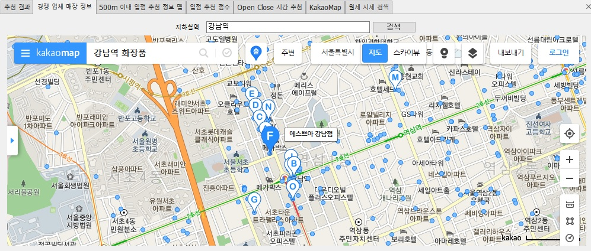
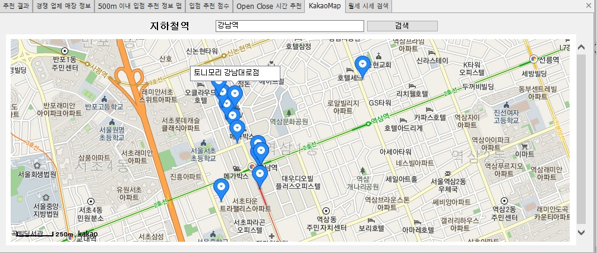
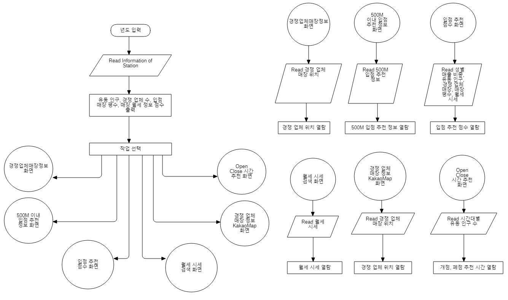

# 매장 입점 지역 추천 시스템

# 개요
매출 데이터, 역세권 유동 인구 분석을 통한 매장 입점 지역 추천 시스템을 구현하였습니다.

# 개발기간
2020년 12월 28일 ~ 2021년 1월 8일

# 참여 인원
IoT기반 스마트팩토리 SW개발 전문가과정

김민경, 김창준, 이시언, 정상훈, 최보화 총 5명

# 개발 환경

### C# Cosmetic Solution Client project
Microsoft Visual Studio Community 2019 v16.8.2

#### 언어
- C# 8.0, Java Script

#### 프레임워크

- .Net FrameWork 4.8
- EntityFrameWork 6.2
- Winform

#### 라이브러리
DevExpress Chart Control v.20.2.4
다음 지도 오픈 API

#### 데이터베이스
Microsoft MS-SQL Server 2019

# 화면 목록
1. 추천 결과 화면

연령별 매출 정보를 DB에서 추출하여 차트에 출력한다.

2. 경쟁 업체 매장 정보 화면

추천된 역 주변의 경쟁 업체 매장 정보를 검색하고 출력한다.

3. 500M 이내 입점 추천 정보 화면

지하철 역 주변의 500M 이내의 입점 추천 정보를 출력한다.

4. 입점 추천 점수 화면

DB에서 지하철 유동인구수, 경쟁 업체 수, 매장 평수, 동일 브랜드 기존 입점 매장 수를 추출하고 항목별로 가중치를 부여한 점수를 구해서 매장 입점 추천 점수를 출력한다.

5. Open Close 시간 추천 화면

지하철 역의 유동 인구 수가 출근 시간이 지난 후 다시 늘어나는 시간을 추출하여 매장의 Open, Close 시간을 추천한다.

6. 경쟁 업체 매장 정보(KakaoMap 화면)

추천된 역 주변의 경쟁 업체 매장 정보를 검색하고 출력한다.(Kakao Map)

7. 월세 시세 검색 화면

추천하는 지하철 역 주변의 월세 시세를 검색하고 출력한다.

# 순서도

# WinForm Classes

# DAO Classes

# Model Classes

# 시퀀스 다이어그램(입점 정보 점수 조회)

# 시퀀스 다이어그램(지하철 역 입점 정보 지도 조회)

# 액티비티 다이어그램

# 유스케이스 다이어그램

# DB 스키마

모든 항목이 제 3 정규화까지 완료되었다.

## 발생한 이슈
1. 입점 추천 점수 화면에서 년도 입력 후 분석 버튼 클릭하면 분석중에 UI가 멈추는 현상이 발생한다.

2. 분석 화면의 데이터를 조회할 때 Cross Exception이 발생하며 프로그램이 다운됐다.

## 원인
1. 1년 간의 지하철 역 1년 데이터에 대한 승객 승하차 정보와 역 테이블 정보를 조인처리 하므로 전체 내용을 DB에 쿼리를 실행할 때 데이터 건수가 많아 DB 쿼리 응답에 시간이 많이 걸려 UI가 멈추는 현상이 발생했다.

2. Thread를 사용하여 DB 쿼리 요청과 UI의 업데이트 코드를 작성했는데 Thread에서 생성하지 않은 UI를 조작할 때 Cross Exception을 발생시킨다.

## 해결 방법
1. 백그라운드 워커를 사용하여 쿼리 요청 부분과 UI 업데이트 부분을 나누어 처리하는 방식으로 변경하여 문제를 해결하였다.

2. Timer 방식도 Cross Exception을 발생시키므로 백그라운드 워커를 사용하여 DB 쿼리와 UI 업데이트 코드를 실행하는 방법으로 해결하였다.
3. 
